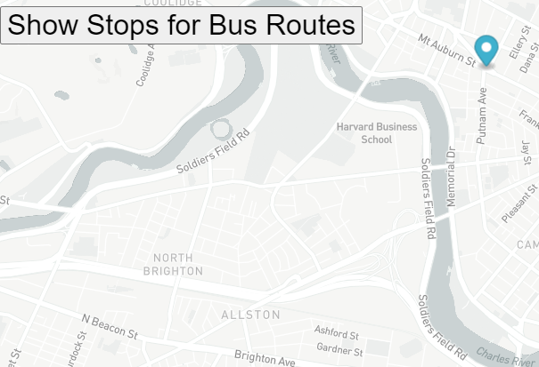

# Bus Tracker
##Every 15 seconds the bus is tracked

Title: Real Time Bus Tracker

Description: This is an app that tracks a bus along a route using GPS coordinates. It uses a real map and real coordinates. It is coded using Javascript.

Directions: Download all files from the repository. Then upload them to your server, once they are uploaded, load index.html into your browser. Once loaded, click the button at the top of the screen to start the animation.

Future Improvements: In the near future I plan on adding more stops and I would like to change the standard flag to a custom one. I would also like to add multiple buses.

License information: MIT License

Copyright (c) 2020 John Williams

Permission is hereby granted, free of charge, to any person obtaining a copy
of this software and associated documentation files (the "Software"), to deal
in the Software without restriction, including without limitation the rights
to use, copy, modify, merge, publish, distribute, sublicense, and/or sell
copies of the Software, and to permit persons to whom the Software is
furnished to do so, subject to the following conditions:

The above copyright notice and this permission notice shall be included in all
copies or substantial portions of the Software.

THE SOFTWARE IS PROVIDED "AS IS", WITHOUT WARRANTY OF ANY KIND, EXPRESS OR
IMPLIED, INCLUDING BUT NOT LIMITED TO THE WARRANTIES OF MERCHANTABILITY,
FITNESS FOR A PARTICULAR PURPOSE AND NONINFRINGEMENT. IN NO EVENT SHALL THE
AUTHORS OR COPYRIGHT HOLDERS BE LIABLE FOR ANY CLAIM, DAMAGES OR OTHER
LIABILITY, WHETHER IN AN ACTION OF CONTRACT, TORT OR OTHERWISE, ARISING FROM,
OUT OF OR IN CONNECTION WITH THE SOFTWARE OR THE USE OR OTHER DEALINGS IN THE
SOFTWARE.

